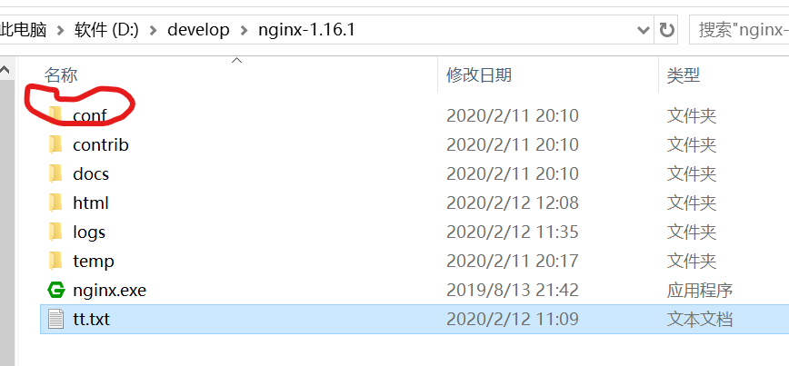
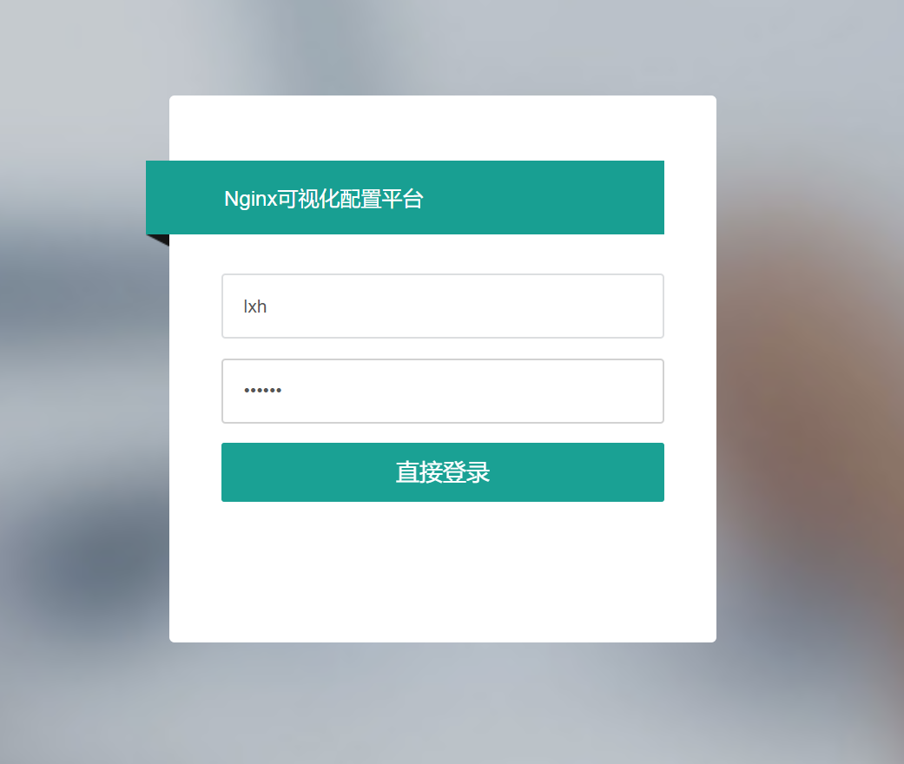
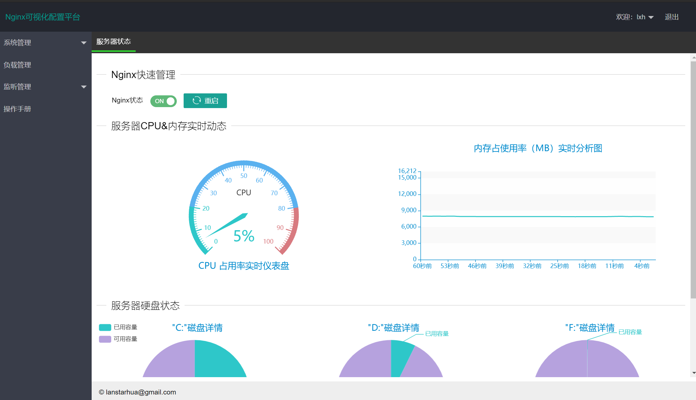
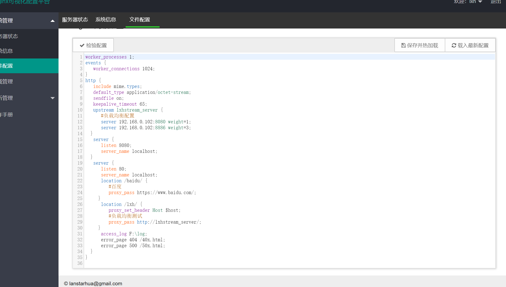
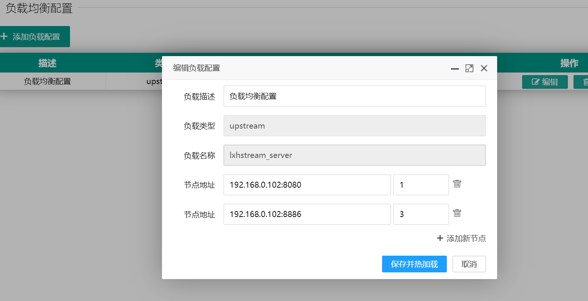
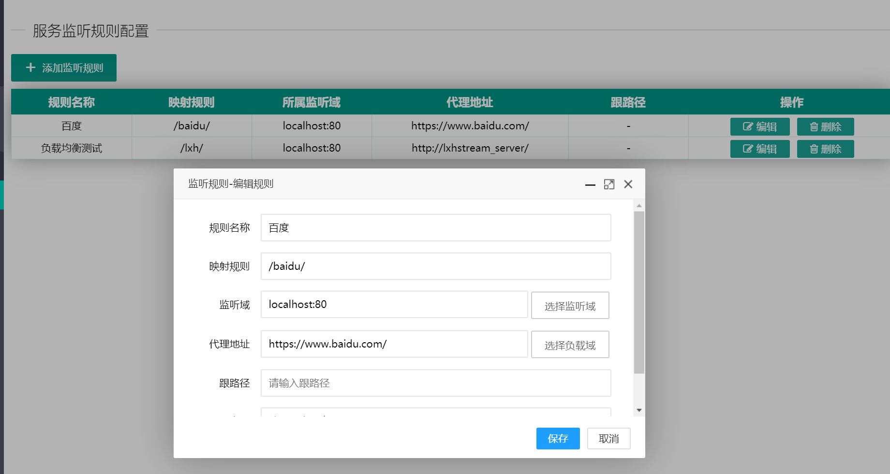

## Nginx可视化配置平台


## 实现原理
其实就是通过web可视化操作，修改nginx服务的配置文件nginx.conf，重新启动。
常用命令如下：
```html
启动服务：nginx -c conf配置文件路径
nginx -c D:\develop\nginx-1.16.1\conf\nginx.conf

停止服务：nginx.exe -s stop

重启服务：nginx.exe -s reload
nginx -s reload -c D:\develop\nginx-1.16.1\conf\nginx.conf

检查配置：nginx -t
nginx -t -c D:\develop\nginx-1.16.1\conf\nginx.conf
```


---
## 实现效果










说白了就是围绕nginx.conf文件来进行web页面上操作。

---

## 如何运行该项目
> 1.拉取项目到Idea里面  
> 2.修改conf.properties中nginx文件路径    
> 3.启动该项目（springboot）  
> 4.访问：http://localhost:8886  
> 5.用户名：lxh  密码：123456  

里面细节自己慢慢研究

---
## nginx配置文件
```html
worker_processes 1;
events {
  worker_connections 1024;
}
http {
  include mime.types;
  default_type application/octet-stream;
  sendfile on;
  keepalive_timeout 65;
  upstream lxhstream_server {
    #负载均衡配置
    server 192.168.0.102:8080 weight=1;
    server 192.168.0.102:8886 weight=3;
  }
  server {
    listen 8080;
    server_name localhost;
  }
  server {
    listen 80;
    server_name localhost;
    location /baidu/ {
      #百度
      proxy_pass https://www.baidu.com/;
    }
    location /lxh/ {
      proxy_set_header Host $host;
      #负载均衡测试
      proxy_pass http://lxhstream_server/;
    }
    access_log F:\log;
    error_page 404 /40x.html;
    error_page 500 /50x.html;
  }
}
```

---

## 怎么测试该项目
> 1.可以通过web页面控制nginx的启动关闭   
> 2.可以配置监听规则，并能成功访问  
> 3.错误页面配置  
> 4.负载均衡配置


---